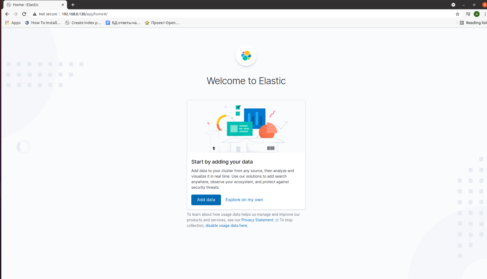
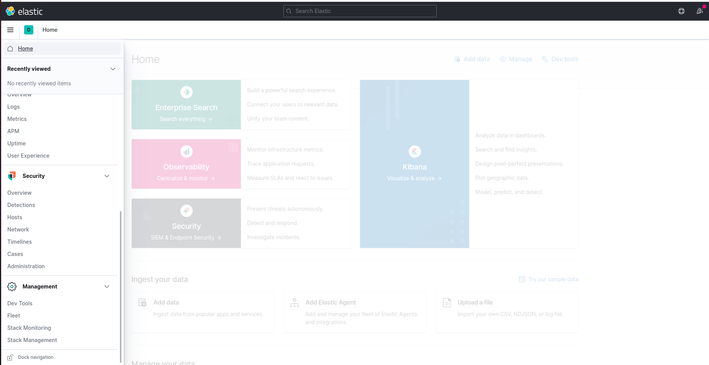
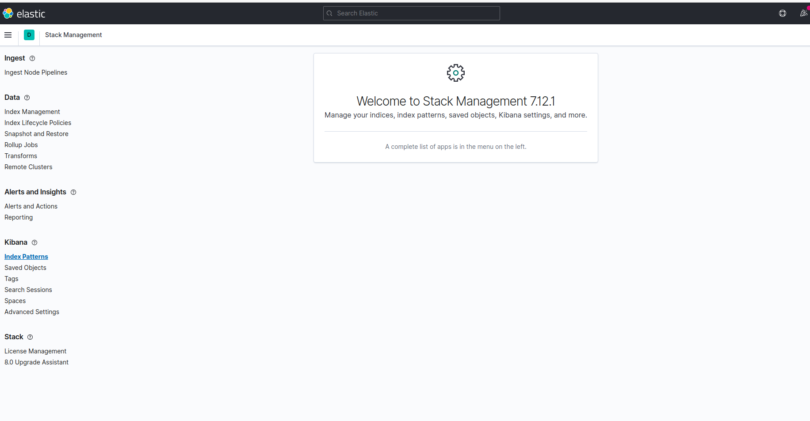
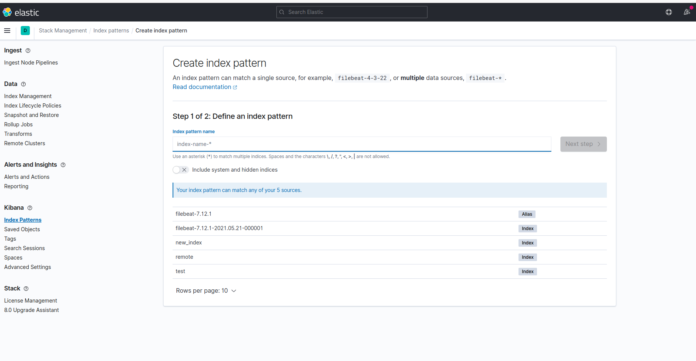
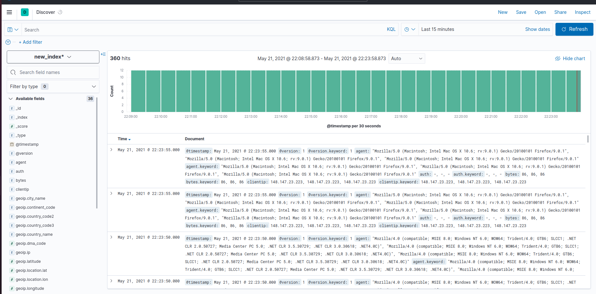

## Setting up the ELK-Stack

### Preparations
Firstly, create container for ELK-stack: 
```bash
 prlctl create StackContainer --vmtype ct --ostemplate centos-8-x86_64
```
 
Create containers, which will be controlled by ELK:

``` bash
 prlctl create Container1 --vmtype ct --ostemplate centos-8-x86_64 
```
Configure the network, setting IP adresses and configure DNS servers:
```bash 
 prlctl set StackContainer --ipadd 192.0.168.130/24
 prlctl set Container1 --ipadd 192.0.168.131/24
 prlctl set StackContainer --nameserver 8.8.8.8
 prlctl set Container1 --nameserver 8.8.8.8
```
Optionally, you can configure memory settings for your StackContainer:
```bash
 prlctl set StackContainer --memsize 4G --swappages 2G
```
In this case RAM the amount of RAM is 4gb and the amount of SWAP is 2gb.

Now, we can start the containers and enter to the StackContainer:
```bash
 prlctl start StackContainer
 prlctl start Container1 
 prlctl enter StackContainer
```
Check the network connection using ping utility:
```bash
 ping google.com
```


### Installing packages 
Update all packets in container:
```bash
 yum update
```
Next, create the config file for Elasticsearch repository:
```bash
 vi etc/yum.repos.d/elasticsearch.repo
```
In this file copy the following text:
```
[elasticstack]
name=Elastic repository for 7.x packages
baseurl=https://artifacts.elastic.co/packages/7.x/yum
gpgcheck=1
gpgkey=https://artifacts.elastic.co/GPG-KEY-elasticsearch
enabled=1
autorefresh=1
type=rpm-md
```
To install Elasticsearch repository, use the following command:
```bash
 dnf update
```
Now we are ready to install the components of ELK-stack.

#### Elasticsearch
Install Elasticsearch packages:
```bash
 dnf install elasticsearch
```
Configure the elasticsearch settings:
```bash
 vi /etc/elasticsearch/elasticsearch.yml
```
Find the following chunk of the text (section Network):
```
# ---------------------------------- Network -----------------------------------
#
# By default Elasticsearch is only accessible on localhost. Set a different
# address here to expose this node on the network:
#
#network.host: 192.168.0.1
#
# By default Elasticsearch listens for HTTP traffic on the first free port it
# finds starting at 9200. Set a specific HTTP port here:
#
#http.port: 9200
#
# For more information, consult the network module documentation.
#
# --------------------------------- Discovery ----------------------------------
#
```
Uncomment fields network.host and http.port:
```
# ---------------------------------- Network -----------------------------------
#
# By default Elasticsearch is only accessible on localhost. Set a different
# address here to expose this node on the network:
#
network.host: 127.0.0.1
#
# By default Elasticsearch listens for HTTP traffic on the first free port it
# finds starting at 9200. Set a specific HTTP port here:
#
http.port: 9200
#
# For more information, consult the network module documentation.
#
# --------------------------------- Discovery ----------------------------------
#
```

To start elasticsearch, enter:
```bash
 systemctl start elasticsearch
```
To set the elasticsearch-service to launch at boot, use:
``` bash
 systemctl enable elasticsearch
```
To test elasticsearch, use:
``` bash
 curl –X GET 127.0.0.1:9200
```
If everything is correct, you will obtain the following output:
```
{
  "name" : "localhost",
  "cluster_name" : "elasticsearch",
  "cluster_uuid" : "VtzeSN1wTQC4RRqnX-_R3g",
  "version" : {
    "number" : "7.12.1",
    "build_flavor" : "default",
    "build_type" : "rpm",
    "build_hash" : "3186837139b9c6b6d23c3200870651f10d3343b7",
    "build_date" : "2021-04-20T20:56:39.040728659Z",
    "build_snapshot" : false,
    "lucene_version" : "8.8.0",
    "minimum_wire_compatibility_version" : "6.8.0",
    "minimum_index_compatibility_version" : "6.0.0-beta1"
  },
  "tagline" : "You Know, for Search"
}
```
**Remark:** If the connection is refused, try to restart the container.

#### Kibana
Install Kibana packages:
``` bash
 dnf install kibana
```

Find the fields server.port, server.host, elasticsearch.hosts and uncomment them:
``` 
# Kibana is served by a back end server. This setting specifies the port to use.
server.port: 5601

# Specifies the address to which the Kibana server will bind. IP addresses and host names are both valid values.
# The default is 'localhost', which usually means remote machines will not be able to connect.
# To allow connections from remote users, set this parameter to a non-loopback address.
server.host: 127.0.0.1
...

...
 
# The Kibana server's name.  This is used for display purposes.
#server.name: "your-hostname"

# The URLs of the Elasticsearch instances to use for all your queries.
elasticsearch.hosts: ["http://localhost:9200"]

```
To start elasticsearch, enter:
```bash
 systemctl start kibana
```
To set the kibana-service to launch at boot, use:
``` bash
 systemctl enable kibana
```

To test kibana, use:
``` bash
 systemctl status kibana
```

If everything is correct, you will obtain the following output:
```
● kibana.service - Kibana
   Loaded: loaded (/etc/systemd/system/kibana.service; enabled; vendor preset: disabled)
   Active: active (running) since Fri 2021-05-21 15:07:58 MSK; 2min 0s ago
     Docs: https://www.elastic.co
 Main PID: 1112 (node)
    Tasks: 11 (limit: 100439)
   Memory: 264.6M
   CGroup: /system.slice/kibana.service
           └─1112 /usr/share/kibana/bin/../node/bin/node /usr/share/kibana/bin/../src/cli/dist --logging.dest=/var/log/kibana/kibana.log --pid.file=/run/kibana/kibana.pid

```

Reverse proxy from port 80 to kibana port in StackContainer:
```bash 
 vi etc/httpd/conf/httpd.conf
```
Find the following text chunk in this file:
```
...
# prevent Apache from glomming onto all bound IP addresses.
#
#Listen 12.34.56.78:80
Listen 80

#
# Dynamic Shared Object (DSO) Support
...
```
Add the proxy command in the following format:
```
...
# prevent Apache from glomming onto all bound IP addresses.
#
#Listen 12.34.56.78:80
Listen 80

ProxyPass "/"  "http://127.0.0.1:5601/"

#
# Dynamic Shared Object (DSO) Support
...
```
Now you can enter to ELK stack browser page by http://192.168.0.130 (StackContainer ip address) from every device, connected in local network:

#### Logstash

Install logstash packages:
``` bash
 dnf install logstash
```
To start logstash, enter:
```bash
 systemctl start logstash
```
To set the logstash-service to launch at boot, use:
``` bash
 systemctl enable logstash
```

#### Filebeat
Install filebeat packages:
```bash 
 yum install filebeat
```

Add the system module, which will examine the system logs:
``` bash 
 filebeat modules enable system
```
Setup filebeat:
``` bash
 filebeat setup
```

To start filebeat, enter:
```
 systemctl start filebeat
```

### Setting up elasticsearch index for local file

Download the log:
``` bash
 wget https://s3.amazonaws.com/logzio-elk/apache-daily-access.log
```

Create the index:

```
 curl -X PUT "localhost:9200/new_index?pretty"
```

Create the logstash pattern:
``` bash 
 cd etc/logstash/conf.d
 vi new_index.conf
```
Fill the file by the following text:
```
input { 
   file {
      path => "path_to_file" 
      start_position => "beginning"
      sincedb_path => "/dev/null" 
 } 
}

filter {

grok {

match => { "message" => "%{COMBINEDAPACHELOG}" }

}

date {

match => [ "timestamp" , "dd/MMM/yyyy:HH:mm:ss Z" ]

}

geoip {

source => "clientip"

}

}

output {

elasticsearch {

hosts => ["localhost:9200"]
index => "new_index"
 }
}
```
Restart the container and start all services.
Go to the ELK stack vrowser page and in left menu find "Stack Management" link in section "Management":


Here find the index pattern page:

Press "Create index" button. You will be on the following page:

Choose the "new_index" index. Then choose time field -- "@timestamp" and push the "create index" button. 

After that in left menu find "Discover" link in Section "Kibana". You will be redirected to the following page:

Now you can analyze the data.


### Setting up elasticsearch index for file in another container

Create the index:
```
 curl -X PUT "localhost:9200/remote?pretty"
```


Create the logstash pattern:
``` bash 
 cd etc/logstash/conf.d
 vi new_index.conf
```
Fill the file by the following text:
```
input {
      beats { port => 5000}      

}

filter {

grok {

match => { "message" => "%{COMBINEDAPACHELOG}" }

}

date {

match => [ "timestamp" , "dd/MMM/yyyy:HH:mm:ss Z" ]

}

geoip {

source => "clientip"

}

}

output {

elasticsearch {

hosts => ["localhost:9200"]
index => "remote"
}

}
```
Restart the container and start all services.

Now, enter the Container1, where our log file will be located:
```bash
 prlctl enter Container1
```
Install the elasticsearch repository and filebeat. The 
proccess of installation is described in the **Installing packages** section.

Download the log:
``` bash
 wget https://s3.amazonaws.com/logzio-elk/apache-daily-access.log
```


Configure the filebeat settings:
```bash
 vi /etc/filebeat/filebeat.yml
```
Modify the "filebeat inputs", "Outputs and "Logstash Output" sections:
```
...
filebeat.inputs:

# Each - is an input. Most options can be set at the input level, so
# you can use different inputs for various configurations.
# Below are the input specific configurations.

- type: log

# Change to true to enable this input configuration.
  enabled: false

  # Paths that should be crawled and fetched. Glob based paths.
  paths:
    - "path_to_file"
   #- c:\programdata\elasticsearch\logs\*


  # Exclude lines. A list of regular expressions to match. It drops the lines that are
  # matching any regular expression from the list.
  #exclude_lines: ['^DBG']
  ...
  # ================================== Outputs ===================================

# Configure what output to use when sending the data collected by the beat.

# ---------------------------- Elasticsearch Output ----------------------------
output.elasticsearch:
  # Array of hosts to connect to.
  hosts: ["192.168.0.130:9200"]

  # Protocol - either `http` (default) or `https`.
  #protocol: "https"

  # Authentication credentials - either API key or username/password.
  #api_key: "id:api_key"
  #username: "elastic"
  #password: "changeme"

# ------------------------------ Logstash Output -------------------------------
#output.logstash:
  # The Logstash hosts
  hosts: ["192.168.0.130:5000"]

  # Optional SSL. By default is off.
  # List of root certificates for HTTPS server verifications
  #ssl.certificate_authorities: ["/etc/pki/root/ca.pem"]

  # Certificate for SSL client authentication
  #ssl.certificate: "/etc/pki/client/cert.pem"

  # Client Certificate Key
  #ssl.key: "/etc/pki/client/cert.key"
...
```
Here 192.168.0.130:9200 is a host of elasticsearch in StackContainer,  192.168.0.130:5000 is a host where logstash try to collect the data.
Restart the filebeat service:
``` bash
 systemctl restart filebeat
```
Now you can go to the ELK stack browser page and set up index "remote" like it is described in section **Setting up elasticsearch index for local file**.
